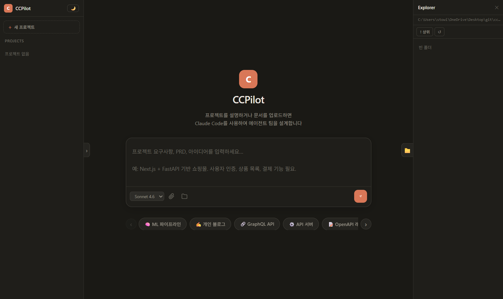

# CCPilot

**[한국어](README.ko.md)**

A kanban-based agent team management WebUI for controlling multiple Claude Code CLI instances from the browser.

[](https://python.org)
[](https://github.com/devchan97/CC-Pilot)
[](https://github.com/devchan97/CC-Pilot)
[](LICENSE)

> Design your agent team from a PRD or description — CCPilot spawns Claude Code instances and tracks them on a kanban board in real time.



---

## Why CCPilot?

Claude API usage can get expensive fast — especially when running multiple long-context sessions. **CCPilot was built to use Claude affordably**, by driving Claude Code CLI (which runs on subscription plans like Claude Pro/Max) instead of calling the API directly.

Instead of paying per-token API costs, CCPilot:

- Launches multiple `claude` CLI subprocesses — each maps to one kanban card
- Reuses your existing Claude subscription authentication (`~/.claude/`)
- Runs sessions in parallel, behaving like multi-threaded API calls — without the per-token bill

The result: you get API-like multi-agent orchestration at the flat monthly cost of a Claude subscription.

---

## Prerequisites

Before running CCPilot, make sure **all three** of the following are set up.

### 1. Python 3.11+

Download from [python.org](https://www.python.org/downloads/) and verify:

```bash
python --version   # must be 3.11 or later
```

> **Windows**: During installation, check **"Add Python to PATH"**.

### 2. Node.js + Claude Code CLI

Claude Code CLI is distributed as an npm package and requires Node.js.

**Step 1 — Install Node.js 18+**

Download the LTS release from [nodejs.org](https://nodejs.org/).

```bash
node --version   # 18.x or later
npm --version
```

**Step 2 — Install Claude Code globally**

```bash
npm install -g @anthropic-ai/claude-code
```

Verify:

```bash
claude --version
```

> **Windows path note**: Claude Code installs to `%APPDATA%\npm\`. If `claude` is not found after install, add `%APPDATA%\npm` to your `PATH` environment variable.

### 3. Claude Code Authentication

CCPilot drives Claude Code as a subprocess and reuses its existing login — no separate API key setup needed.

Run Claude Code once to log in:

```bash
claude
```

Follow the prompts to log in with your Anthropic account. Credentials are stored in `~/.claude/` and reused automatically by CCPilot.

Verify it works:

```bash
claude -p "hello"
```

---

## Quick Start

```bash
git clone https://github.com/devchan97/CC-Pilot
cd CC-Pilot
python main.py
```

The browser opens automatically at `http://localhost:8080`.

```bash
# Custom port
python main.py --port 9000

# Open in system browser instead of native app window
python main.py --browser

# Enable DevTools for the native app window
python main.py --debug

# Start in fullscreen mode
python main.py --fullscreen
```

> **Native app window** requires `pywebview`. If not installed, CCPilot automatically falls back to the system browser — no action needed.

---

## ⚠️ Dangerous Permissions — Read Before Use

CCPilot launches every Claude Code session with `--dangerously-skip-permissions` by default. This means **Claude will execute tools (file edits, shell commands, web requests, etc.) without asking for confirmation**.

> **You are solely responsible for any consequences of running CCPilot with this flag.**
> This includes unintended file modifications, data loss, execution of destructive commands, or any other side effects caused by Claude acting autonomously on your machine.
> Use CCPilot only in environments you control, on files you can afford to lose or restore from version control.

This flag is intentional for an automated agent workflow — you issue tasks, Claude executes them autonomously. It is designed for developers who understand and accept the risks.

If you want Claude to run with the **default interactive permission prompts** instead, remove or comment out the flag in `ccpilot/session.py`:

```python
# ccpilot/session.py  ·  Session.send()
cmd = base + [
    "--dangerously-skip-permissions",   # ← remove this line to re-enable prompts
    "--print",
    "--output-format", "stream-json",
    "--verbose",
]
```

> **Note**: If you remove the flag, Claude will pause at every tool-use prompt. Since CCPilot streams output over WebSocket, those prompts will not be visible in the UI and the session will appear to hang. Only remove the flag if you are running CCPilot in a supervised or sandboxed environment.

> **Planned**: Per-working-directory sandbox isolation is on the roadmap — each agent will be confined to its designated working directory, preventing cross-directory access.

---

## Agent Teams Setup

### Automatic (recommended)

1. Open CCPilot and go to the **Home** screen.
2. Select a mode: **Plan** (new project), **Refactor** (existing codebase), or **Enhance** (optimization).
3. Paste your PRD, requirements doc, or project description in the text box. Optionally attach files or design images.
4. Click **Send (↑)** or press `Ctrl+Enter`.
5. Claude analyzes the input and proposes a team of agents with roles, working directories, and initial prompts.
6. Review the proposal, adjust agent names / models / paths if needed, then click **Approve & Spawn**.
7. All agents are created as **Backlog** cards. Move them to **In Progress** to start execution.

### Manual

1. Select or create a **Project** in the left sidebar.
2. Click **+ Task** (top right) or **+ Add Task** at the bottom of any column.
3. Fill in task name, working directory, model, and initial message.
4. The session starts in the selected phase.

### Team Planning Panel (inside kanban view)

Click **⚡ Auto-generate Team** in the top bar to open the Planning Panel without leaving the board.
You can paste text or upload a `.md`/`.txt` file and run the planner from there.

### Agent Initial Prompt Tips

- The initial prompt is sent automatically when the session connects (or when moved from Backlog → In Progress).
- Reference `AGENTS.md` in the project root — it is auto-generated by the planner and contains the full team context.
- Recommended pattern for parallel work:

```
Read AGENTS.md for the full team context.
Your role: [role description]
Working directory: [path]

Start immediately. For independent sub-modules, use `claude --agents` to parallelize.
Check /skills first for available tools.
```

---

## Platform Notes

### Windows

- Python: install from [python.org](https://www.python.org/downloads/) — check **"Add Python to PATH"**
- Node.js: install from [nodejs.org](https://nodejs.org/)
- After `npm install -g @anthropic-ai/claude-code`, add `%APPDATA%\npm` to PATH if `claude` is not found
- Run `python main.py` from Command Prompt or PowerShell (not double-click)

### macOS

```bash
brew install python node
npm install -g @anthropic-ai/claude-code
```

### Linux (Ubuntu/Debian)

```bash
sudo apt install python3 nodejs npm
npm install -g @anthropic-ai/claude-code
```

---

## Features

- **Three planning modes** — Plan (new project), Refactor (existing codebase), Enhance (optimization) — each with dedicated prompts
- **Design file upload** — Attach images (PNG/JPG/WebP) and documents (MD/TXT/JSON) to spawn modal; files are saved to `design/` and referenced in agent prompts
- **EN / KO language toggle** — Switch UI language at any time; preference persisted via localStorage
- **Agent team planning** — Paste a PRD or upload a doc, Claude designs the team structure and spawns agents automatically
- **Multi-session kanban** — Manage multiple Claude Code instances as Backlog / In Progress / Done cards
- **Real-time streaming** — WebSocket-based output with `thinking`, `tool_use`, and token/cost tracking
- **Message queue** — Messages sent while an agent is busy are queued and auto-flushed; queue depth shown on the card badge and in the detail modal
- **`/model` inline switcher** — Type `/model` to open an inline model picker (Opus 4.6 / Sonnet 4.6 / Haiku 4.5); or `/model <name>` to switch directly, persisted immediately
- **Session persistence** — Sessions survive restarts via `--resume`, stored in SQLite (`ccpilot.db`), restored automatically on next launch
- **Usage limit detection** — Detects Claude plan/rate limit errors, enters wait mode, and shows reset time in the UI
- **Trash / restore** — Accidentally closed a card? Recover it from the sidebar trash bin (retains chat log)
- **Custom confirm dialogs** — All destructive actions use in-app modals instead of browser `alert()`
- **Built-in file explorer** — Browse and select working directories from the sidebar without leaving the UI
- **OS folder dialog** — Click 📁 Folder Browse in the Explorer toolbar to open a native folder picker
- **Auto-compact** — Context window auto-compacted when usage reaches the limit, work resumes automatically
- **57 quick-start templates** — Shuffled carousel of project templates with stack variant options
- **Fullscreen mode** — Launch with `--fullscreen` for a distraction-free experience
- **Zero dependencies** — Pure Python standard library, no pip required at runtime

---

## How It Works

```
Browser (WebUI)
     │  WebSocket / HTTP
     ▼
main.py  ──►  ccpilot/routes.py      (HTTP router)
              ccpilot/websocket.py   (WS protocol)
              ccpilot/session.py     (Claude CLI subprocess)
              ccpilot/planning.py    (agent team design — Plan mode)
              ccpilot/refactoring.py (agent team design — Refactor mode)
              ccpilot/enhancement.py (agent team design — Enhance mode)
              ccpilot/projects.py    (project management)
              ccpilot/db.py          (SQLite persistence)
                    │
                    ▼
              claude --dangerously-skip-permissions --resume <session-id>
```

Each kanban card maps to one Claude Code subprocess. The server streams JSON output and forwards it to the browser over WebSocket in real time.

On exit (window close, Ctrl+C, or SIGTERM), CCPilot terminates all Claude subprocesses in parallel before quitting.

---

## Project Structure

```
cc-pilot/
├── main.py                 # Entry point (signal handling, clean shutdown)
├── ccpilot/                # Backend package (stdlib only)
│   ├── utils.py            # Static serving, path resolution, Claude discovery
│   ├── types.py            # EventType constants
│   ├── db.py               # SQLite persistence (auto-migrates from JSON)
│   ├── http_utils.py       # json_response / error_response helpers
│   ├── session.py          # Session lifecycle + SessionManager
│   ├── projects.py         # Project CRUD
│   ├── planning.py         # LLM agent team planning (Plan mode)
│   ├── refactoring.py      # LLM agent team planning (Refactor mode)
│   ├── enhancement.py      # LLM agent team planning (Enhance mode)
│   ├── websocket.py        # RFC 6455 WebSocket implementation
│   └── routes.py           # Async HTTP router
├── public/                 # Frontend (no build step)
│   ├── index.html
│   ├── js/
│   │   ├── constants.js    # AppState, HOME_TEMPLATES_RAW, HOME_VARIANTS
│   │   ├── i18n.js         # EN/KO translations, t(), toggleLang()
│   │   ├── ws.js           # WebSocket client, theme/lang helpers
│   │   ├── home.js         # Home screen logic
│   │   ├── kanban.js       # Kanban board
│   │   ├── modal.js        # Spawn modal, planning panel
│   │   └── explorer.js     # File explorer
│   └── css/
│       ├── base.css        # Variables, reset, lang-btn
│       ├── home.css        # Home screen styles
│       └── kanban.css      # Kanban board + modal styles
├── ccpilot.db              # SQLite database (auto-created)
└── tests/                  # Unit & integration tests (stdlib unittest)
```

---

## API Endpoints

| Method | Path | Description |
|--------|------|-------------|
| `GET` | `/` | Serve index.html |
| `GET` | `/static/*` | Static assets |
| `WS` | `/ws/{sid}` | WebSocket stream |
| `GET` | `/api/sessions` | List saved sessions |
| `POST` | `/api/sessions/restore` | Restore sessions on startup |
| `POST` | `/api/session` | Create session |
| `DELETE` | `/api/session/{sid}` | Delete session |
| `POST` | `/api/session/{sid}/phase` | Move kanban phase |
| `POST` | `/api/session/{sid}/rename` | Rename task |
| `POST` | `/api/session/{sid}/model` | Change session model |
| `GET` | `/api/projects` | List projects |
| `POST` | `/api/projects` | Create project |
| `POST` | `/api/projects/{pid}/rename` | Rename project |
| `DELETE` | `/api/projects/{pid}` | Delete project |
| `POST` | `/api/plan/text` | Plan/Refactor/Enhance from text (`mode`, `lang`, `design_files`) |
| `POST` | `/api/plan/file` | Plan/Refactor/Enhance from file upload (`mode`, `lang`) |
| `POST` | `/api/plan/spawn` | Spawn agent team (`design_files` saved to `design/`) |
| `GET` | `/api/explorer?dir=` | List directory |
| `POST` | `/api/explorer/open` | Open in OS file explorer |
| `POST` | `/api/explorer/read` | Read file contents |
| `GET` | `/api/folder-dialog` | OS native folder picker dialog |

---

## Build (Executable)

Packages CCPilot as a standalone `.exe` using PyInstaller + pywebview (native app window).

```bash
pip install pyinstaller pywebview
pyinstaller CCPilot.spec
# Output: dist/CCPilot.exe
```

Pre-built binaries for Windows are available on the [Releases](https://github.com/devchan97/CC-Pilot/releases) page.

> The `.exe` bundles CCPilot itself. **Claude Code CLI and its authentication are still required** on the target machine (see Prerequisites above).

---

## Contributing

```bash
git clone https://github.com/devchan97/CC-Pilot
cd CC-Pilot
python main.py  # no install step needed
```

Run the test suite (no extra packages required):

```bash
python -m unittest discover tests
```

All backend code is under `ccpilot/`. Frontend is plain HTML/CSS/JS in `public/` — no bundler or build step required.

---

## License

MIT
